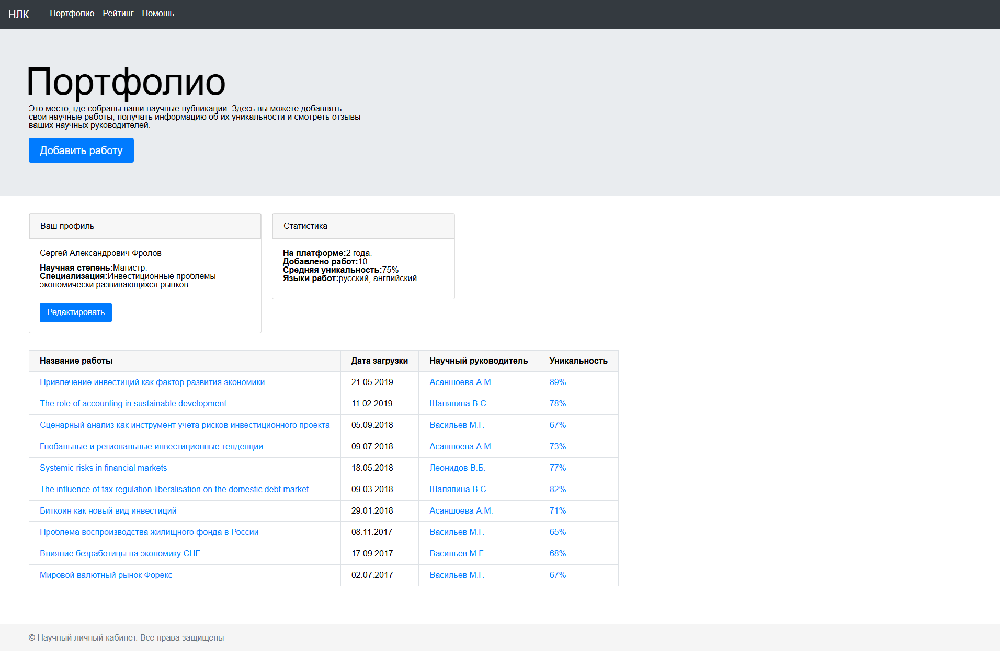
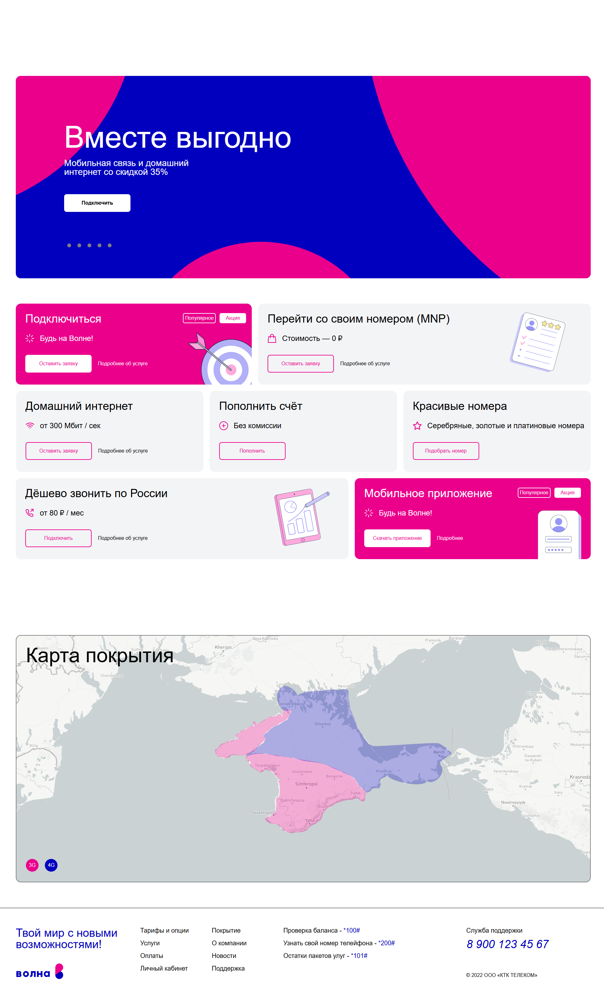
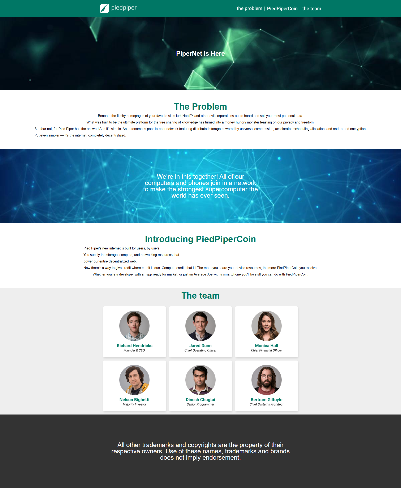

# 🎨 Верстка макетов из Figma

Этот проект включает верстку **4 макетов**, созданных в Figma.  
Макеты выполнены с использованием современных технологий (HTML, CSS, SCSS).  

---

## 🚀 Используемый стек

  

---

## 🖼️ Превью макетов

| Макет | Превью | Ссылка на код |
|-------|--------|---------------|
| Макет 1 |  | [🔗 Код](https://github.com/Shamitsu212/figma-to-html/tree/main/figma1) |
| Макет 2 |  | [🔗 Код](https://github.com/Shamitsu212/figma-to-html/tree/main/figma2) |
| Макет 3 |  | [🔗 Код](https://github.com/Shamitsu212/figma-to-html/tree/main/figma3) |
| Макет 4 |  | [🔗 Код](https://github.com/Shamitsu212/figma-to-html/tree/main/figma4) |

---
