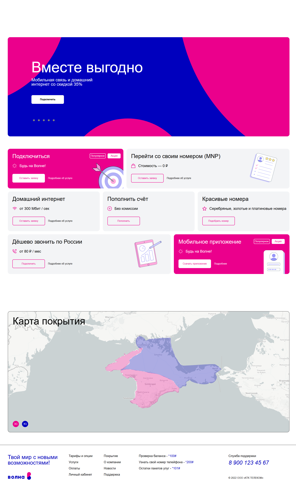

# 🎨 Верстка макетов из Figma

Этот проект включает верстку **4 макетов**, созданных в Figma.  
Макеты выполнены с использованием современных технологий (HTML, CSS, SCSS).  

---

## 🚀 Используемый стек

  

---

## 🖼️ Превью макетов

Ccылка -

 

---
